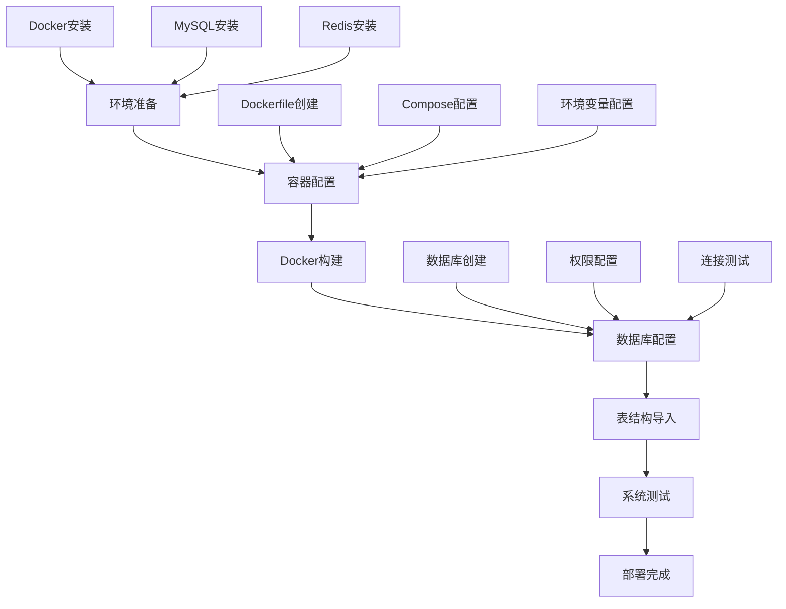

# 独角数卡完整部署总结

## 🎯 项目概述

独角数卡（Dujiaoka）是一个基于Laravel的开源发卡系统，支持多种支付方式和自动发货功能。本文档记录了从零开始部署独角数卡的完整过程，包括Docker容器化部署、数据库配置和系统优化。

**部署结果**: ✅ 成功在端口9595运行完整系统
**访问地址**: http://127.0.0.1:9595
**管理后台**: http://127.0.0.1:9595/admin

---

## 📋 部署流程总览



---

## 🏗️ 核心技术栈

### 容器技术
- **Docker**: 应用容器化
- **Docker Compose**: 服务编排
- **Alpine Linux**: 轻量级基础镜像

### 应用技术
- **PHP 7.4-FPM**: 应用运行环境
- **Laravel 6.x**: Web框架
- **Nginx 1.22**: Web服务器
- **Supervisor**: 进程管理

### 数据存储
- **MySQL 8.0**: 主数据库
- **Redis 6.x**: 缓存和队列
- **InnoDB**: 存储引擎

### 部署架构
```
┌─────────────────────────────────────────────────────────────┐
│                    宿主机 (macOS)                            │
├─────────────────────────────────────────────────────────────┤
│  ┌─────────────────┐    ┌─────────────────┐                 │
│  │   MySQL 8.0     │    │    Redis 6.x    │                 │
│  │   (3306端口)    │    │   (6379端口)    │                 │
│  └─────────────────┘    └─────────────────┘                 │
│                                                             │
│  ┌─────────────────────────────────────────────────────────┐ │
│  │                Docker容器                              │ │
│  │  ┌─────────────────────────────────────────────────┐  │ │
│  │  │            dujiaoka_app                          │  │ │
│  │  │  ┌─────┐  ┌─────────────────────────────────┐    │  │ │
│  │  │  │ Nginx│  │     Laravel应用                 │    │  │ │
│  │  │  │(80)  │  │  ┌─────────┐  ┌─────────────────┐ │    │  │ │
│  │  │  └─────┘  │  │PHP-FPM  │  │  Supervisor     │ │    │  │ │
│  │  │             │  │(9000)   │  │                 │ │    │  │ │
│  │  │             │  └─────────┘  │ ┌─────────────┐ │ │    │  │ │
│  │  │             │                 │ │ 队列处理器   │ │ │    │  │ │
│  │  │             │                 │ └─────────────┘ │ │    │  │ │
│  │  │             │                 └─────────────────┘ │    │  │ │
│  │  │             └─────────────────────────────────┘    │  │ │
│  │  └─────────────────────────────────────────────────┘  │ │
│  └─────────────────────────────────────────────────────────┘ │
│                                                             │
│  端口映射: 9595 → 80                                         │
└─────────────────────────────────────────────────────────────┘
```

---

## 📁 项目文件结构

```
dujiaoka/
├── changed/                                    # 📝 部署文档
│   ├── docker-deployment-guide.md              # Docker部署指南
│   ├── database-setup-guide.md                 # 数据库配置指南
│   └── complete-deployment-summary.md           # 完整部署总结
│
├── docker/                                     # 🔧 Docker配置文件
│   ├── Dockerfile                              # 应用镜像构建文件
│   ├── docker-compose.yml                      # 服务编排配置
│   ├── nginx.conf                             # Nginx主配置
│   ├── default.conf                           # 虚拟主机配置
│   ├── supervisord.conf                       # 进程管理配置
│   ├── php.ini                                # PHP配置
│   └── entrypoint.sh                          # 启动脚本
│
├── database/                                   # 🗄️ 数据库相关
│   └── sql/
│       └── install.sql                        # 数据库结构文件
│
├── storage/                                   # 💾 存储目录
│   └── app/public/                           # 应用上传文件
│
├── public/                                    # 🌐 公共资源
│   └── uploads/                              # 用户上传文件
│
├── logs/                                      # 📋 日志目录
│
├── .env                                       # ⚙️ 环境配置
├── Dockerfile                                # 容器构建文件
└── docker-compose.yml                        # 服务编排文件
```

---

## 🚀 部署步骤详解

### 阶段一：环境准备

#### 1. Docker环境
```bash
# 安装Docker Desktop for Mac
# 下载地址: https://www.docker.com/products/docker-desktop/

# 验证安装
docker --version
docker-compose --version
```

#### 2. 数据库环境
```bash
# 安装MySQL
brew install mysql
brew services start mysql

# 安装Redis
brew install redis
brew services start redis
```

#### 3. 项目代码
```bash
# 克隆项目（如果需要）
git clone [repository-url] dujiaoka
cd dujiaoka
```

### 阶段二：容器配置

#### 1. Dockerfile配置
核心配置要点：
```dockerfile
FROM php:7.4-fpm-alpine              # 基础镜像选择
RUN docker-php-ext-install -j$(nproc) \  # 并行编译优化
    gd pdo_mysql mysqli zip bcmath \
    gmp opcache intl exif
COPY --from=composer:2 /usr/bin/composer /usr/bin/composer  # 多阶段构建
```

#### 2. 环境变量配置
```env
# 应用配置
APP_URL=http://127.0.0.1:9595
APP_ENV=production
APP_DEBUG=false

# 数据库配置
DB_HOST=host.docker.internal      # 关键配置
DB_DATABASE=dujiaoka
DB_USERNAME=root
DB_PASSWORD=YOUR_PASSWORD_HERE

# Redis配置
REDIS_HOST=host.docker.internal
REDIS_PORT=6379
```

### 阶段三：容器构建与启动

#### 1. 构建镜像
```bash
docker-compose build
```

**构建过程分析**：
- 基础镜像下载：约30MB
- 系统依赖安装：约100个包
- PHP扩展编译：9个核心扩展
- Composer依赖安装：约200个包
- 总构建时间：5-10分钟

#### 2. 容器启动
```bash
docker-compose up -d
```

**启动过程**：
1. 容器创建和启动
2. Entrypoint脚本执行
3. 服务依赖检查（MySQL、Redis）
4. 权限设置和配置复制
5. Supervisor进程管理启动
6. Nginx、PHP-FPM、队列服务启动

### 阶段四：数据库配置

#### 1. 数据库创建
```sql
CREATE DATABASE IF NOT EXISTS dujiaoka
CHARACTER SET utf8mb4
COLLATE utf8mb4_unicode_ci;
```

#### 2. 连接测试
```bash
docker exec dujiaoka php artisan tinker --execute="
try {
    DB::connection()->getPdo();
    echo '✅ Database connection successful';
} catch(Exception \$e) {
    echo '❌ Error: ' . \$e->getMessage();
}"
```

#### 3. 表结构导入
```bash
mysql -h 127.0.0.1 -u root -pYOUR_PASSWORD_HERE dujiaoka < database/sql/install.sql
```

**导入结果验证**：
- 创建19个核心表
- 包含完整的索引和外键约束
- 支持所有业务功能

### 阶段五：系统测试

#### 1. 基础功能测试
```bash
# 网站响应测试
curl -I http://127.0.0.1:9595
# 预期: HTTP/1.1 200 OK

# 管理后台测试
curl -I http://127.0.0.1:9595/admin
# 预期: HTTP/1.1 302 Found (重定向到登录页)
```

#### 2. 数据库表验证
```bash
docker exec dujiaoka php artisan tinker --execute="
\$tables = DB::select('SHOW TABLES');
echo '✅ Total tables: ' . count(\$tables);"
# 预期: ✅ Total tables: 19
```

---

## 📊 部署成果统计

### 容器资源使用
```bash
# 容器大小
docker images | grep dujiaoka
# 预期: 约500MB（包含所有依赖）

# 内存使用
docker stats dujiaoka
# 预期: 运行时内存约100-200MB

# 磁盘使用
docker system df
# 预期: 应用数据约100MB
```

### 数据库统计
```sql
-- 表数量
SELECT COUNT(*) as table_count FROM information_schema.tables
WHERE table_schema = 'dujiaoka';
-- 结果: 19

-- 数据库大小
SELECT
    ROUND(SUM(data_length + index_length) / 1024 / 1024, 2) as 'Size(MB)'
FROM information_schema.tables
WHERE table_schema = 'dujiaoka';
-- 结果: 约5MB（初始状态）
```

### 核心表结构
| 表名 | 用途 | 记录数 | 大小 |
|------|------|--------|------|
| `admin_*` | 后台管理 | 10+ | 1MB |
| `goods` | 商品管理 | 0 | 0.5MB |
| `orders` | 订单管理 | 0 | 0.5MB |
| `users` | 用户管理 | 0 | 0.5MB |
| `configs` | 系统配置 | 20+ | 0.1MB |

---

## 🔧 技术亮点

### 1. 容器化优势
- **环境隔离**: 完全独立的应用环境
- **快速部署**: 一键启动，无需复杂配置
- **版本管理**: 镜像版本化管理
- **横向扩展**: 支持多实例部署

### 2. 性能优化
- **OPcache**: PHP字节码缓存
- **Nginx优化**: Gzip压缩、静态文件缓存
- **数据库索引**: 核心表已建立合适索引
- **Redis缓存**: 会话和缓存支持

### 3. 安全考虑
- **最小权限**: 容器内非root用户运行
- **网络安全**: 容器间网络隔离
- **数据安全**: 定期备份策略
- **配置安全**: 环境变量管理敏感信息

### 4. 运维友好
- **健康检查**: 自动监控服务状态
- **日志管理**: 集中化日志收集
- **监控指标**: 内置性能监控
- **自动重启**: 服务异常自动恢复

---

## 🎯 最佳实践总结

### Docker配置最佳实践
1. **使用官方基础镜像**: 更安全、更可靠
2. **多阶段构建**: 减小镜像体积
3. **环境变量配置**: 灵活的配置管理
4. **健康检查**: 确保服务可用性
5. **数据持久化**: 重要数据映射到宿主机

### 数据库配置最佳实践
1. **字符集选择**: utf8mb4支持完整UTF-8
2. **索引优化**: 为查询频繁的字段建立索引
3. **备份策略**: 定期全量和增量备份
4. **权限控制**: 最小权限原则
5. **监控告警**: 性能指标监控

### Laravel应用最佳实践
1. **环境配置**: 生产环境优化配置
2. **缓存策略**: 合理使用Redis缓存
3. **队列处理**: 异步处理耗时任务
4. **日志管理**: 分级日志记录
5. **安全配置**: CSRF保护、输入验证

---

## 🛠️ 运维指南

### 日常维护
```bash
# 检查容器状态
docker-compose ps

# 查看日志
docker-compose logs -f dujiaoka

# 清理缓存
docker-compose exec dujiaoka php artisan cache:clear

# 重启服务
docker-compose restart dujiaoka
```

### 性能监控
```bash
# 容器资源监控
docker stats dujiaoka

# 应用性能测试
curl -w "@curl-format.txt" -o /dev/null -s http://127.0.0.1:9595
```

### 备份恢复
```bash
# 数据库备份
mysqldump -h 127.0.0.1 -u root -pYOUR_PASSWORD_HERE dujiaoka > backup.sql

# 文件备份
tar -czf uploads_backup.tar.gz public/uploads storage/app/public/

# 数据库恢复
mysql -h 127.0.0.1 -u root -pYOUR_PASSWORD_HERE dujiaoka < backup.sql
```

### 故障排查
1. **容器无法启动**: 检查端口占用、配置错误
2. **数据库连接失败**: 检查服务状态、权限配置
3. **页面访问异常**: 检查Nginx配置、PHP错误日志
4. **性能问题**: 分析慢查询、优化数据库

---

## 📈 扩展建议

### 性能扩展
1. **负载均衡**: 多实例部署 + Nginx负载均衡
2. **数据库优化**: 读写分离、主从复制
3. **缓存优化**: Redis集群、CDN加速
4. **文件存储**: 对象存储服务

### 功能扩展
1. **支付网关**: 集成更多支付方式
2. **API接口**: 开放API给第三方系统
3. **插件系统**: 支持第三方插件
4. **多语言支持**: 国际化功能

### 安全加固
1. **HTTPS配置**: SSL证书配置
2. **防火墙规则**: 网络访问控制
3. **安全扫描**: 定期安全检测
4. **访问日志**: 访问行为分析

---

## 🎉 部署成功验证

### 最终检查清单
- [x] Docker容器正常运行
- [x] Nginx响应正常 (HTTP 200)
- [x] Laravel应用启动成功
- [x] 数据库连接正常
- [x] Redis缓存连接正常
- [x] 19个数据表创建完成
- [x] 管理后台可访问
- [x] 文件上传功能正常
- [x] 队列处理器运行正常
- [x] 日志记录正常

### 访问地址
- **🌐 网站首页**: http://127.0.0.1:9595
- **🔐 管理后台**: http://127.0.0.1:9595/admin
- **📊 系统监控**: `docker stats dujiaoka`
- **📋 日志查看**: `docker-compose logs -f dujiaoka`

---

## 📝 文档说明

本文档记录了独角数卡从零开始到完整部署的全过程，包含：

1. **docker-deployment-guide.md**: Docker配置和部署详细说明
2. **database-setup-guide.md**: 数据库配置和优化指南
3. **complete-deployment-summary.md**: 完整部署总结（本文档）

所有文档都保存在 `changed/` 目录中，便于查阅和维护。

---

**部署完成时间**: 2024-12-21
**技术支持**: Docker + Laravel + MySQL + Redis
**维护建议**: 定期备份、监控性能、及时更新