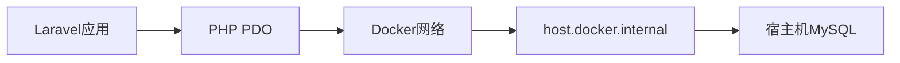

# 独角数卡数据库配置详细指南

## 📋 目录
1. [数据库架构设计](#数据库架构设计)
2. [数据库安装配置](#数据库安装配置)
3. [表结构创建过程](#表结构创建过程)
4. [数据迁移脚本](#数据迁移脚本)
5. [性能优化配置](#性能优化配置)
6. [备份恢复策略](#备份恢复策略)
7. [故障排查](#故障排查)

---

## 🗄️ 数据库架构设计

### 技术选型
- **数据库**: MySQL 8.0+
- **字符集**: utf8mb4 (完整支持UTF-8，包括emoji)
- **排序规则**: utf8mb4_unicode_ci (Unicode兼容性最好)
- **存储引擎**: InnoDB (支持事务、外键、行级锁)

### 连接配置
```env
# .env 文件配置
DB_CONNECTION=mysql
DB_HOST=host.docker.internal  # Docker容器访问宿主机
DB_PORT=3306
DB_DATABASE=dujiaoka
DB_USERNAME=root
DB_PASSWORD=YOUR_PASSWORD_HERE
```

### 连接原理


---

## 🛠️ 数据库安装配置

### 1. MySQL安装（MacOS）
```bash
# 使用Homebrew安装
brew install mysql

# 启动MySQL服务
brew services start mysql

# 设置root密码
mysql_secure_installation
```

### 2. 创建数据库
```sql
-- 登录MySQL
mysql -u root -p

-- 创建独角数卡数据库
CREATE DATABASE IF NOT EXISTS dujiaoka
CHARACTER SET utf8mb4
COLLATE utf8mb4_unicode_ci;

-- 验证创建
SHOW DATABASES LIKE 'dujiaoka';
```

### 3. 用户权限配置
```sql
-- 创建专用用户（可选）
CREATE USER 'dujiaoka'@'%' IDENTIFIED BY 'your_password';

-- 授权访问
GRANT ALL PRIVILEGES ON dujiaoka.* TO 'dujiaoka'@'%';

-- 刷新权限
FLUSH PRIVILEGES;

-- 验证用户
SHOW GRANTS FOR 'dujiaoka'@'%';
```

### 4. 连接测试
```bash
# 命令行测试
mysql -h 127.0.0.1 -u root -pYOUR_PASSWORD_HERE -e "SELECT 'Connection OK';"

# 容器内测试
docker exec dujiaoka php artisan tinker --execute="
try {
    DB::connection()->getPdo();
    echo '✅ Database connection successful';
} catch(Exception \$e) {
    echo '❌ Error: ' . \$e->getMessage();
}"
```

---

## 📋 表结构创建过程

### 1. SQL文件位置
```
dujiaoka/
└── database/
    └── sql/
        └── install.sql    # 完整数据库结构
```

### 2. install.sql文件分析

#### 文件头部配置
```sql
-- 设置字符集和禁用外键检查
SET NAMES utf8mb4;
SET FOREIGN_KEY_CHECKS = 0;
```

**说明**:
- `SET NAMES utf8mb4`: 确保客户端连接使用正确字符集
- `SET FOREIGN_KEY_CHECKS = 0`: 临时禁用外键检查，便于表重建

#### 核心表结构

##### 1. 管理后台相关表
```sql
-- 管理员菜单表
CREATE TABLE `admin_menu` (
  `id` bigint unsigned NOT NULL AUTO_INCREMENT,
  `parent_id` bigint NOT NULL DEFAULT '0',      -- 父菜单ID
  `order` int NOT NULL DEFAULT '0',           -- 排序
  `title` varchar(50) NOT NULL,               -- 菜单标题
  `icon` varchar(50) DEFAULT NULL,            -- 图标
  `uri` varchar(50) DEFAULT NULL,             -- 路由URI
  `extension` varchar(50) NOT NULL DEFAULT '',-- 扩展名
  `show` tinyint NOT NULL DEFAULT '1',        -- 是否显示
  `created_at` timestamp NULL DEFAULT NULL,   -- 创建时间
  `updated_at` timestamp NULL DEFAULT NULL,   -- 更新时间
  PRIMARY KEY (`id`)
) ENGINE=InnoDB DEFAULT CHARSET=utf8mb4 COLLATE=utf8mb4_unicode_ci;
```

**字段说明**:
- `parent_id = 0`: 表示顶级菜单
- `order`: 控制菜单显示顺序
- `show`: 控制菜单是否在前台显示

##### 2. 系统配置表
```sql
-- 系统配置表
CREATE TABLE `configs` (
  `id` bigint unsigned NOT NULL AUTO_INCREMENT,
  `group` varchar(50) NOT NULL,              -- 配置分组
  `name` varchar(50) NOT NULL,               -- 配置名称
  `value` text,                              -- 配置值
  `created_at` timestamp NULL DEFAULT NULL,  -- 创建时间
  `updated_at` timestamp NULL DEFAULT NULL,  -- 更新时间
  PRIMARY KEY (`id`),
  UNIQUE KEY `configs_group_name_unique` (`group`,`name`)
) ENGINE=InnoDB DEFAULT CHARSET=utf8mb4 COLLATE=utf8mb4_unicode_ci;
```

**设计特点**:
- 支持配置分组管理
- 唯一索引确保同一分组内配置名不重复
- value字段使用text类型，支持复杂配置

##### 3. 商品管理表
```sql
-- 商品表
CREATE TABLE `goods` (
  `id` bigint unsigned NOT NULL AUTO_INCREMENT,
  `gd_name` varchar(191) NOT NULL,           -- 商品名称
  `gd_description` text,                    -- 商品描述
  `gd_type` tinyint NOT NULL DEFAULT '1',    -- 商品类型
  `gd_price` decimal(10,2) NOT NULL,         -- 商品价格
  `gd_quantity` int NOT NULL DEFAULT '-1',  -- 商品数量
  `gd_group_id` bigint NOT NULL DEFAULT '0', -- 商品分组
  `gd_picture` varchar(191) DEFAULT NULL,    -- 商品图片
  `gd_content` longtext,                    -- 商品详细内容
  `gd_min_buy` int NOT NULL DEFAULT '1',     -- 最小购买数量
  `gd_max_buy` int NOT NULL DEFAULT '0',     -- 最大购买数量
  `gd_api_type` varchar(50) DEFAULT NULL,    -- API类型
  `gd_api_data` text,                        -- API数据
  `gd_auto_accept` tinyint NOT NULL DEFAULT '1', -- 自动接单
  `gd_api_rate` decimal(5,4) NOT NULL DEFAULT '1.0000', -- API汇率
  `gd_status` tinyint NOT NULL DEFAULT '1',  -- 商品状态
  `created_at` timestamp NULL DEFAULT NULL,
  `updated_at` timestamp NULL DEFAULT NULL,
  PRIMARY KEY (`id`),
  KEY `goods_gd_group_id_index` (`gd_group_id`)
) ENGINE=InnoDB DEFAULT CHARSET=utf8mb4 COLLATE=utf8mb4_unicode_ci;
```

**重要字段**:
- `gd_quantity = -1`: 表示无限库存
- `gd_min_buy/gd_max_buy`: 购买数量限制
- `gd_api_*`: 自动发货相关配置

##### 4. 订单管理表
```sql
-- 订单表
CREATE TABLE `orders` (
  `id` bigint unsigned NOT NULL AUTO_INCREMENT,
  `order_sn` varchar(32) NOT NULL,           -- 订单号
  `user_id` bigint NOT NULL DEFAULT '0',     -- 用户ID
  `total_amount` decimal(10,2) NOT NULL,     -- 订单总金额
  `pay_amount` decimal(10,2) NOT NULL,       -- 支付金额
  `pay_way` varchar(50) NOT NULL,           -- 支付方式
  `pay_status` tinyint NOT NULL DEFAULT '0', -- 支付状态
  `order_status` tinyint NOT NULL DEFAULT '0', -- 订单状态
  `goods_info` text,                         -- 商品信息
  `coupon_info` text,                        -- 优惠券信息
  `notify_url` varchar(191) DEFAULT NULL,    -- 通知URL
  `email` varchar(191) DEFAULT NULL,        -- 邮箱地址
  `contact_info` text,                       -- 联系信息
  `result_info` text,                        -- 结果信息
  `created_at` timestamp NULL DEFAULT NULL,
  `updated_at` timestamp NULL DEFAULT NULL,
  PRIMARY KEY (`id`),
  UNIQUE KEY `orders_order_sn_unique` (`order_sn`),
  KEY `orders_user_id_index` (`user_id`)
) ENGINE=InnoDB DEFAULT CHARSET=utf8mb4 COLLATE=utf8mb4_unicode_ci;
```

**状态码说明**:
- `pay_status`: 0=未支付, 1=已支付, 2=支付失败
- `order_status`: 0=待处理, 1=已完成, 2=已取消

### 3. 导入过程
```bash
# 方法1: 使用mysql命令行
mysql -h 127.0.0.1 -u root -pYOUR_PASSWORD_HERE dujiaoka < database/sql/install.sql

# 方法2: 使用source命令
mysql -h 127.0.0.1 -u root -pYOUR_PASSWORD_HERE dujiaoka
mysql> source database/sql/install.sql;

# 方法3: 使用图形化工具（phpMyAdmin、Navicat等）
# 选择dujiaoka数据库，导入install.sql文件
```

### 4. 验证导入结果
```sql
-- 查看所有表
SHOW TABLES FROM dujiaoka;

-- 统计表数量
SELECT COUNT(*) as table_count FROM information_schema.tables
WHERE table_schema = 'dujiaoka';

-- 查看表结构
DESCRIBE dujiaoka.goods;
DESCRIBE dujiaoka.orders;
```

```bash
# Laravel方式验证
docker exec dujiaoka php artisan tinker --execute="
\$tables = DB::select('SHOW TABLES');
echo '✅ Total tables: ' . count(\$tables);
echo PHP_EOL;
foreach(\$tables as \$table) {
    \$tableName = array_values((array)\$table)[0];
    echo '  - ' . \$tableName . PHP_EOL;
}"
```

---

## 🔄 数据迁移脚本

### 1. Laravel迁移文件
独角数卡使用传统的SQL文件而不是Laravel迁移，但我们可以创建迁移文件：

```php
// database/migrations/2024_01_01_000000_create_dujiaoka_tables.php
use Illuminate\Database\Migrations\Migration;
use Illuminate\Database\Schema\Blueprint;
use Illuminate\Support\Facades\Schema;

class CreateDujiaokaTables extends Migration
{
    public function up()
    {
        Schema::create('goods', function (Blueprint $table) {
            $table->id();
            $table->string('gd_name', 191);
            $table->text('gd_description')->nullable();
            $table->tinyInteger('gd_type')->default(1);
            $table->decimal('gd_price', 10, 2);
            $table->integer('gd_quantity')->default(-1);
            $table->bigInteger('gd_group_id')->default(0);
            $table->string('gd_picture', 191)->nullable();
            $table->longText('gd_content')->nullable();
            $table->integer('gd_min_buy')->default(1);
            $table->integer('gd_max_buy')->default(0);
            $table->string('gd_api_type', 50)->nullable();
            $table->text('gd_api_data')->nullable();
            $table->tinyInteger('gd_auto_accept')->default(1);
            $table->decimal('gd_api_rate', 5, 4)->default(1.0000);
            $table->tinyInteger('gd_status')->default(1);
            $table->timestamps();

            $table->index('gd_group_id');
        });
    }

    public function down()
    {
        Schema::dropIfExists('goods');
    }
}
```

### 2. 数据导入脚本
```php
// app/Console/Commands/ImportDujiaokaData.php
namespace App\Console\Commands;

use Illuminate\Console\Command;
use Illuminate\Support\Facades\DB;

class ImportDujiaokaData extends Command
{
    protected $signature = 'dujiaoka:import-data';
    protected $description = 'Import dujiaoka initial data';

    public function handle()
    {
        $sqlFile = database_path('sql/install.sql');

        if (!file_exists($sqlFile)) {
            $this->error('SQL file not found: ' . $sqlFile);
            return 1;
        }

        $this->info('Importing database structure...');

        try {
            DB::unprepared(file_get_contents($sqlFile));
            $this->info('✅ Database structure imported successfully!');

            // Show statistics
            $tables = DB::select('SHOW TABLES');
            $this->info('✅ Created ' . count($tables) . ' tables');

            return 0;
        } catch (\Exception $e) {
            $this->error('❌ Import failed: ' . $e->getMessage());
            return 1;
        }
    }
}
```

### 3. 执行导入
```bash
# 使用Laravel命令
docker exec dujiaoka php artisan dujiaoka:import-data

# 或直接运行SQL
docker exec dujiaoka php artisan tinker --execute="
DB::unprepared(file_get_contents('/app/database/sql/install.sql'));
echo '✅ Import completed';"
```

---

## ⚡ 性能优化配置

### 1. MySQL配置优化
```ini
# /etc/mysql/my.cnf 或 ~/.my.cnf
[mysqld]
# 基础配置
default-storage-engine = InnoDB
character-set-server = utf8mb4
collation-server = utf8mb4_unicode_ci

# 内存配置
innodb_buffer_pool_size = 1G              # 缓冲池大小（建议为系统内存的70-80%）
innodb_log_file_size = 256M               # 日志文件大小
innodb_log_buffer_size = 16M              # 日志缓冲区
key_buffer_size = 32M                     # MyISAM索引缓冲区

# 连接配置
max_connections = 200                     # 最大连接数
max_connect_errors = 1000                 # 最大连接错误数
wait_timeout = 28800                      # 连接超时时间

# 查询缓存
query_cache_type = 1                      # 启用查询缓存
query_cache_size = 128M                   # 查询缓存大小

# 慢查询日志
slow_query_log = 1                        # 启用慢查询日志
slow_query_log_file = /var/log/mysql/slow.log
long_query_time = 2                       # 慢查询阈值（秒）

# 二进制日志（用于备份和恢复）
log_bin = mysql-bin
binlog_format = ROW
expire_logs_days = 7                      # 日志保留天数
```

### 2. 索引优化
```sql
-- 分析表使用情况
SELECT
    table_schema,
    table_name,
    engine,
    table_rows,
    data_length,
    index_length,
    (data_length + index_length) as total_size
FROM information_schema.tables
WHERE table_schema = 'dujiaoka'
ORDER BY total_size DESC;

-- 查看索引使用情况
SELECT
    table_name,
    index_name,
    column_name,
    cardinality,
    sub_part,
    packed,
    nullable,
    index_type
FROM information_schema.statistics
WHERE table_schema = 'dujiaoka'
ORDER BY table_name, seq_in_index;

-- 分析查询性能
EXPLAIN SELECT * FROM orders WHERE order_status = 0;
EXPLAIN SELECT * FROM goods WHERE gd_group_id = 1 AND gd_status = 1;
```

### 3. 建议的额外索引
```sql
-- 订单表优化索引
CREATE INDEX idx_orders_pay_status ON orders(pay_status);
CREATE INDEX idx_orders_order_status ON orders(order_status);
CREATE INDEX idx_orders_created_at ON orders(created_at);
CREATE INDEX idx_orders_user_status ON orders(user_id, order_status);

-- 商品表优化索引
CREATE INDEX idx_goods_group_status ON goods(gd_group_id, gd_status);
CREATE INDEX idx_goods_type_status ON goods(gd_type, gd_status);
CREATE INDEX idx_goods_auto_accept ON goods(gd_auto_accept, gd_status);

-- 用户表优化索引
CREATE INDEX idx_users_email ON users(email);
CREATE INDEX idx_users_created_at ON users(created_at);

-- 支付日志表优化索引
CREATE INDEX idx_pay_logs_status ON pay_logs(pay_status);
CREATE INDEX idx_pay_logs_order_id ON pay_logs(order_id);
```

### 4. 定期维护任务
```sql
-- 定期优化表
OPTIMIZE TABLE dujiaoka.orders;
OPTIMIZE TABLE dujiaoka.goods;
OPTIMIZE TABLE dujiaoka.users;

-- 分析表统计信息
ANALYZE TABLE dujiaoka.orders;
ANALYZE TABLE dujiaoka.goods;
ANALYZE TABLE dujiaoka.users;

-- 检查表完整性
CHECK TABLE dujiaoka.orders;
CHECK TABLE dujiaoka.goods;
CHECK TABLE dujiaoka.users;
```

---

## 💾 备份恢复策略

### 1. 全量备份脚本
```bash
#!/bin/bash
# backup_full.sh - 完整备份脚本

BACKUP_DIR="/path/to/backups"
DATE=$(date +%Y%m%d_%H%M%S)
DB_NAME="dujiaoka"
DB_USER="root"
DB_PASS="YOUR_PASSWORD_HERE"
DB_HOST="127.0.0.1"

# 创建备份目录
mkdir -p $BACKUP_DIR

# 数据库备份
echo "开始备份数据库..."
mysqldump -h $DB_HOST -u $DB_USER -p$DB_PASS \
  --single-transaction \
  --routines \
  --triggers \
  --all-tablespaces \
  --add-drop-database \
  --databases $DB_NAME | gzip > $BACKUP_DIR/db_backup_$DATE.sql.gz

if [ $? -eq 0 ]; then
    echo "✅ 数据库备份成功: db_backup_$DATE.sql.gz"
else
    echo "❌ 数据库备份失败"
    exit 1
fi

# 文件备份
echo "开始备份上传文件..."
tar -czf $BACKUP_DIR/uploads_backup_$DATE.tar.gz \
    public/uploads/ \
    storage/app/public/

if [ $? -eq 0 ]; then
    echo "✅ 文件备份成功: uploads_backup_$DATE.tar.gz"
else
    echo "❌ 文件备份失败"
    exit 1
fi

# 配置文件备份
echo "开始备份配置文件..."
cp .env $BACKUP_DIR/env_backup_$DATE

# 清理旧备份（保留30天）
find $BACKUP_DIR -name "*.gz" -mtime +30 -delete
find $BACKUP_DIR -name "env_backup_*" -mtime +30 -delete

echo "✅ 备份完成: $DATE"
```

### 2. 增量备份脚本
```bash
#!/bin/bash
# backup_incremental.sh - 增量备份脚本

BACKUP_DIR="/path/to/backups"
DATE=$(date +%Y%m%d_%H%M%S)
DB_NAME="dujiaoka"
DB_USER="root"
DB_PASS="YOUR_PASSWORD_HERE"
DB_HOST="127.0.0.1"

# 检查二进制日志是否启用
if ! mysql -h $DB_HOST -u $DB_USER -p$DB_PASS -e "SHOW VARIABLES LIKE 'log_bin';" | grep -q "ON"; then
    echo "❌ 二进制日志未启用，无法进行增量备份"
    exit 1
fi

# 获取当前binlog位置
mysql -h $DB_HOST -u $DB_USER -p$DB_PASS -e "SHOW MASTER STATUS;" > $BACKUP_DIR/binlog_position_$DATE.txt

# 备份最近的binlog文件
BINLOG_FILE=$(mysql -h $DB_HOST -u $DB_USER -p$DB_PASS -e "SHOW MASTER STATUS\G" | grep "File:" | awk '{print $2}')

mysqlbinlog --read-from-remote-server \
  --host=$DB_HOST \
  --user=$DB_USER \
  --password=$DB_PASS \
  --raw \
  --stop-never \
  $BINLOG_FILE

echo "✅ 增量备份完成: $DATE"
```

### 3. 恢复脚本
```bash
#!/bin/bash
# restore.sh - 数据库恢复脚本

if [ $# -ne 1 ]; then
    echo "用法: $0 <backup_file>"
    echo "示例: $0 db_backup_20240101_120000.sql.gz"
    exit 1
fi

BACKUP_FILE=$1
DB_NAME="dujiaoka"
DB_USER="root"
DB_PASS="YOUR_PASSWORD_HERE"
DB_HOST="127.0.0.1"

if [ ! -f "$BACKUP_FILE" ]; then
    echo "❌ 备份文件不存在: $BACKUP_FILE"
    exit 1
fi

echo "开始恢复数据库..."
echo "备份文件: $BACKUP_FILE"

# 确认恢复操作
read -p "⚠️  此操作将覆盖现有数据库，是否继续？(y/N): " confirm
if [ "$confirm" != "y" ] && [ "$confirm" != "Y" ]; then
    echo "操作已取消"
    exit 0
fi

# 删除现有数据库（保留其他数据库）
mysql -h $DB_HOST -u $DB_USER -p$DB_PASS -e "DROP DATABASE IF EXISTS $DB_NAME;"

# 创建新数据库
mysql -h $DB_HOST -u $DB_USER -p$DB_PASS -e "CREATE DATABASE $DB_NAME CHARACTER SET utf8mb4 COLLATE utf8mb4_unicode_ci;"

# 恢复数据
if [[ $BACKUP_FILE == *.gz ]]; then
    gunzip -c $BACKUP_FILE | mysql -h $DB_HOST -u $DB_USER -p$DB_PASS $DB_NAME
else
    mysql -h $DB_HOST -u $DB_USER -p$DB_PASS $DB_NAME < $BACKUP_FILE
fi

if [ $? -eq 0 ]; then
    echo "✅ 数据库恢复成功"
else
    echo "❌ 数据库恢复失败"
    exit 1
fi

echo "恢复完成！"
```

### 4. 自动化备份
```bash
# 添加到crontab
crontab -e

# 每天凌晨2点执行全量备份
0 2 * * * /path/to/backup_full.sh >> /var/log/backup.log 2>&1

# 每4小时执行增量备份
0 */4 * * * /path/to/backup_incremental.sh >> /var/log/backup.log 2>&1
```

---

## 🔍 故障排查

### 1. 常见错误及解决方案

#### 连接被拒绝
```bash
# 错误信息
SQLSTATE[HY000] [2002] Connection refused

# 排查步骤
# 1. 检查MySQL服务状态
brew services list | grep mysql
ps aux | grep mysql

# 2. 检查端口占用
lsof -i :3306
netstat -an | grep 3306

# 3. 重启MySQL服务
brew services restart mysql

# 4. 检查配置文件
mysql --help | grep "Default options"
```

#### 权限不足
```bash
# 错误信息
SQLSTATE[28000] [1045] Access denied for user 'root'@'localhost'

# 解决方案
# 1. 重置root密码
mysql_secure_installation

# 2. 重新授权
mysql -u root -p
ALTER USER 'root'@'localhost' IDENTIFIED BY 'new_password';
GRANT ALL PRIVILEGES ON *.* TO 'root'@'localhost' WITH GRANT OPTION;
FLUSH PRIVILEGES;
```

#### 表不存在
```bash
# 错误信息
SQLSTATE[42S02]: Base table or view not found: 1146 Table 'dujiaoka.goods' doesn't exist

# 排查步骤
# 1. 确认数据库存在
SHOW DATABASES LIKE 'dujiaoka';

# 2. 确认表存在
USE dujiaoka;
SHOW TABLES;

# 3. 重新导入表结构
mysql -h 127.0.0.1 -u root -p dujiaoka < database/sql/install.sql
```

#### 字符集问题
```bash
# 错误信息
SQLSTATE[HY000]: General error: 1366 Incorrect string value

# 解决方案
# 1. 检查字符集
SHOW VARIABLES LIKE 'character_set%';
SHOW VARIABLES LIKE 'collation%';

# 2. 修改表字符集
ALTER TABLE dujiaoka.goods CONVERT TO CHARACTER SET utf8mb4 COLLATE utf8mb4_unicode_ci;

# 3. 修改配置文件
# my.cnf
[mysql]
default-character-set = utf8mb4

[mysqld]
character-set-server = utf8mb4
collation-server = utf8mb4_unicode_ci
```

### 2. 性能问题诊断
```sql
-- 慢查询分析
SELECT * FROM mysql.slow_log ORDER BY start_time DESC LIMIT 10;

-- 锁等待分析
SHOW ENGINE INNODB STATUS\G

-- 连接数分析
SHOW PROCESSLIST;
SHOW STATUS LIKE 'Threads%';
SHOW STATUS LIKE 'Connections';
SHOW STATUS LIKE 'Max_used_connections';

-- 缓冲池使用情况
SELECT
    pool_size,
    buffer_pool_size,
    pages_flushed,
    pages_read,
    pages_created
FROM information_schema.innodb_metrics
WHERE name LIKE 'buffer_pool_%';
```

### 3. 数据完整性检查
```sql
-- 检查所有表
CHECK TABLE dujiaoka.goods;
CHECK TABLE dujiaoka.orders;
CHECK TABLE dujiaoka.users;
CHECK TABLE dujiaoka.configs;

-- 修复表（如果需要）
REPAIR TABLE dujiaoka.goods;

-- 优化表
OPTIMIZE TABLE dujiaoka.goods;

-- 更新统计信息
ANALYZE TABLE dujiaoka.goods;
```

### 4. 监控指标
```sql
-- 数据库大小
SELECT
    table_schema as '数据库',
    ROUND(SUM(data_length + index_length) / 1024 / 1024, 2) as '大小(MB)'
FROM information_schema.tables
WHERE table_schema = 'dujiaoka'
GROUP BY table_schema;

-- 表大小
SELECT
    table_name as '表名',
    ROUND(((data_length + index_length) / 1024 / 1024), 2) as '大小(MB)'
FROM information_schema.tables
WHERE table_schema = 'dujiaoka'
ORDER BY (data_length + index_length) DESC;

-- 查询缓存命中率
SHOW STATUS LIKE 'Qcache%';
SELECT
    (QCACHE_HITS / (QCACHE_HITS + QCACHE_INSERTS + QCACHE_NOT_CACHED)) * 100 as '命中率'
FROM information_schema.global_status;

-- InnoDB缓冲池命中率
SELECT
    (1 - (Innodb_buffer_pool_reads / Innodb_buffer_pool_read_requests)) * 100 as '命中率'
FROM information_schema.global_status;
```

---

## 📊 总结

通过这套完整的数据库配置方案，我们实现了：

1. **🗄️ 完整的表结构**: 19个核心表，覆盖所有业务功能
2. **🔧 优化的配置**: 字符集、索引、性能调优
3. **💾 可靠的备份**: 全量+增量备份策略
4. **🔍 详细的监控**: 性能指标和故障诊断
5. **🛡️ 数据安全**: 权限控制和完整性检查

数据库配置完成后，独角数卡系统具备了稳定运行的基础，可以支持高并发的订单处理和数据管理需求。