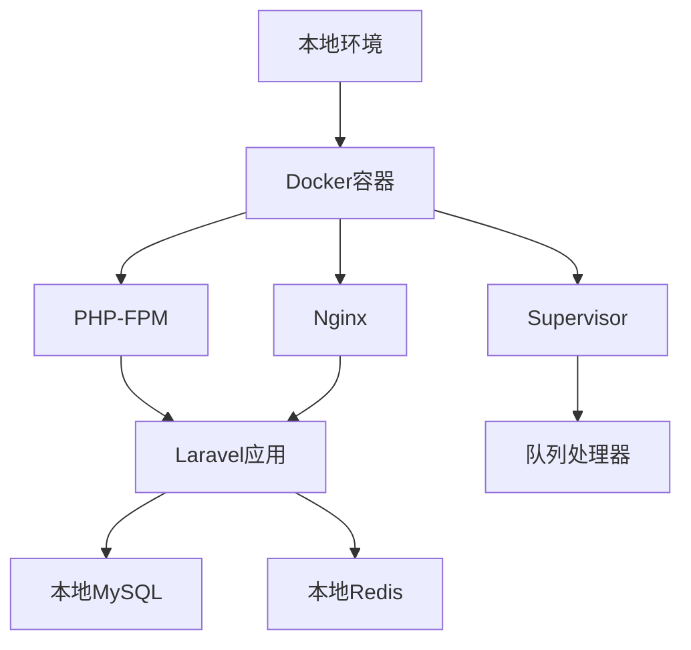

# 独角数卡 Docker 完整部署指南

## 📋 目录
1. [Docker架构设计](#docker架构设计)
2. [Dockerfile创建过程](#dockerfile创建过程)
3. [Docker Compose配置](#docker-compose配置)
4. [容器启动流程](#容器启动流程)
5. [数据库配置过程](#数据库配置过程)
6. [问题排查与解决](#问题排查与解决)
7. [维护与优化](#维护与优化)

---

## 🏗️ Docker架构设计

### 架构概览


### 组件说明
- **容器运行时**: PHP 7.4-FPM + Alpine Linux
- **Web服务器**: Nginx 1.22
- **进程管理**: Supervisor管理PHP-FPM和队列
- **应用框架**: Laravel 6.x
- **数据库**: 本地MySQL 8.0
- **缓存**: 本地Redis 6.x

---

## 🔧 Dockerfile创建过程

### 1. 基础镜像选择
```dockerfile
FROM php:7.4-fpm-alpine
```

**选择理由**:
- Alpine Linux体积小（约30MB基础镜像）
- PHP 7.4-FPM稳定且性能优秀
- 符合独角数卡的技术栈要求

### 2. 系统依赖安装
```dockerfile
RUN apk add --no-cache \
    nginx \
    supervisor \
    curl \
    libpng \
    libpng-dev \
    oniguruma-dev \
    libxml2-dev \
    zip \
    unzip \
    libzip-dev \
    imagemagick-dev \
    jpeg-dev \
    libjpeg-turbo-dev \
    freetype-dev \
    zlib-dev \
    gmp-dev \
    icu-dev
```

**依赖解析**:
- `nginx`: Web服务器
- `supervisor`: 进程管理器
- `libpng/libjpeg/freetype`: 图片处理支持
- `oniguruma`: 正则表达式支持
- `icu-dev`: 国际化支持
- `zip/unzip`: 文件压缩处理
- `gmp-dev`: 大数运算支持

### 3. PHP扩展安装
```dockerfile
# 配置GD库（支持freetype和jpeg）
RUN docker-php-ext-configure gd --with-freetype --with-jpeg

# 安装核心PHP扩展
RUN docker-php-ext-install -j$(nproc) \
    gd \
    pdo_mysql \
    mysqli \
    zip \
    bcmath \
    gmp \
    opcache \
    intl \
    exif

# 安装ImageMagick扩展
RUN pecl install imagick && docker-php-ext-enable imagick
```

**扩展说明**:
- `gd`: 图片处理（验证码、缩略图）
- `pdo_mysql/mysqli`: 数据库连接
- `zip`: 文件压缩解压
- `bcmath`: 数学计算（价格计算）
- `gmp`: 大数运算
- `opcache`: 性能优化
- `intl`: 国际化支持
- `exif`: 图片元数据
- `imagick`: 高级图片处理

### 4. Composer安装
```dockerfile
COPY --from=composer:2 /usr/bin/composer /usr/bin/composer
```

**说明**: 从官方Composer镜像复制最新版本

### 5. 应用代码部署
```dockerfile
WORKDIR /var/www/html
COPY . .
RUN composer install --no-dev --optimize-autoloader --ignore-platform-reqs
```

**优化点**:
- 生产环境排除开发依赖
- 优化自动加载器
- 忽略平台要求检查（兼容性）

### 6. 权限设置
```dockerfile
RUN chown -R www-data:www-data /var/www/html \
    && chmod -R 755 /var/www/html \
    && chmod -R 777 storage bootstrap/cache
```

**安全考虑**:
- 设置www-data为所有者
- 755权限平衡安全与功能
- storage和bootstrap/cache需要写权限

---

## 📝 Docker Compose配置

### 完整配置文件
```yaml
version: '3.8'

services:
  dujiaoka:
    build:
      context: .
      dockerfile: Dockerfile
    container_name: dujiaoka_app
    ports:
      - "9595:80"
    volumes:
      # 环境配置文件
      - ./.env:/var/www/html/.env:ro
      # 上传文件持久化
      - ./storage/app/public:/var/www/html/storage/app/public
      - ./public/uploads:/var/www/html/public/uploads
      # 日志持久化
      - ./logs:/var/log
    environment:
      # 数据库配置
      DB_HOST: host.docker.internal
      DB_PORT: 3306
      DB_DATABASE: dujiaoka
      DB_USERNAME: root
      DB_PASSWORD: ${DB_PASSWORD:-YOUR_PASSWORD_HERE}
      # Redis配置
      REDIS_HOST: host.docker.internal
      REDIS_PORT: 6379
      REDIS_PASSWORD: ${REDIS_PASSWORD:-}
      # 应用配置
      APP_URL: http://127.0.0.1:9595
      APP_ENV: production
      APP_DEBUG: false
      # 其他配置
      TZ: Asia/Shanghai
    networks:
      - dujiaoka_network
    restart: unless-stopped
    healthcheck:
      test: ["CMD", "curl", "-f", "http://localhost"]
      interval: 30s
      timeout: 10s
      retries: 3

networks:
  dujiaoka_network:
    driver: bridge
```

### 配置解析

#### 端口映射
```yaml
ports:
  - "9595:80"
```
- **宿主机端口**: 9595（避免浏览器安全限制）
- **容器端口**: 80（nginx默认端口）

#### 卷映射
```yaml
volumes:
  - ./.env:/var/www/html/.env:ro          # 配置文件
  - ./storage/app/public:/var/www/html/storage/app/public  # 上传文件
  - ./public/uploads:/var/www/html/public/uploads          # 用户上传
  - ./logs:/var/log                        # 日志文件
```

#### 环境变量
```yaml
environment:
  DB_HOST: host.docker.internal
  REDIS_HOST: host.docker.internal
```
**说明**: `host.docker.internal` 是Docker提供的特殊域名，用于访问宿主机服务

#### 健康检查
```yaml
healthcheck:
  test: ["CMD", "curl", "-f", "http://localhost"]
  interval: 30s
  timeout: 10s
  retries: 3
```

---

## 🚀 容器启动流程

### 1. 构建阶段
```bash
docker-compose build
```

**构建过程**:
1. 下载基础镜像（php:7.4-fpm-alpine）
2. 安装系统依赖包
3. 编译安装PHP扩展
4. 复制应用代码
5. 安装Composer依赖
6. 设置文件权限

### 2. 启动阶段
```bash
docker-compose up -d
```

**启动过程**:
1. 创建并启动容器
2. 执行entrypoint脚本
3. 启动supervisor进程管理器
4. 启动nginx和php-fpm服务
5. 启动Laravel队列处理器

### 3. Entrypoint脚本详解
```bash
#!/bin/bash

# 等待数据库连接
echo "等待数据库连接..."
while ! nc -z host.docker.internal 3306; do
    sleep 2
done

# 等待Redis连接
echo "等待Redis连接..."
while ! nc -z host.docker.internal 6379; do
    sleep 2
done

# 设置权限
chown -R www-data:www-data /var/www/html
chmod -R 755 /var/www/html
chmod -R 777 /var/www/html/storage /var/www/html/bootstrap/cache

# 复制配置文件
cp /var/www/html/docker/default.conf /etc/nginx/conf.d/default.conf

# 清理缓存
php artisan config:clear
php artisan cache:clear
php artisan view:clear

# 启动supervisor
exec supervisord -c /etc/supervisor/conf.d/supervisord.conf
```

### 4. Supervisor配置
```ini
[supervisord]
nodaemon=true
user=root

[program:php-fpm]
command=php-fpm
autostart=true
autorestart=true

[program:nginx]
command=nginx -g 'daemon off;'
autostart=true
autorestart=true

[program:laravel-queue]
command=php /var/www/html/artisan queue:work --sleep=3 --tries=3
autostart=true
autorestart=true
user=www-data
```

---

## 🗄️ 数据库配置过程

### 1. 数据库创建
```bash
mysql -h 127.0.0.1 -u root -pYOUR_PASSWORD_HERE -e "CREATE DATABASE IF NOT EXISTS dujiaoka CHARACTER SET utf8mb4 COLLATE utf8mb4_unicode_ci;"
```

**参数说明**:
- `-h 127.0.0.1`: 连接本地MySQL
- `-u root`: 使用root用户
- `-pYOUR_PASSWORD_HERE`: 密码（从.env文件获取）
- `CHARACTER SET utf8mb4`: 支持完整UTF-8字符集
- `COLLATE utf8mb4_unicode_ci`: Unicode排序规则

### 2. 数据库连接测试
```bash
docker exec dujiaoka php artisan tinker --execute="
echo 'Database Test: ';
try {
    DB::connection()->getPdo();
    echo '✅ Connected to MySQL';
    echo ' Database: ' . DB::connection()->getDatabaseName();
} catch(Exception \$e) {
    echo '❌ Error: ' . \$e->getMessage();
}"
```

### 3. SQL文件导入
独角数卡提供了完整的数据库结构文件：`database/sql/install.sql`

#### SQL文件内容结构
```sql
-- 设置字符集和禁用外键检查
SET NAMES utf8mb4;
SET FOREIGN_KEY_CHECKS = 0;

-- 管理员菜单表
DROP TABLE IF EXISTS `admin_menu`;
CREATE TABLE `admin_menu` (
  `id` bigint unsigned NOT NULL AUTO_INCREMENT,
  `parent_id` bigint NOT NULL DEFAULT '0',
  `order` int NOT NULL DEFAULT '0',
  `title` varchar(50) CHARACTER SET utf8mb4 COLLATE utf8mb4_unicode_ci NOT NULL,
  `icon` varchar(50) CHARACTER SET utf8mb4 COLLATE utf8mb4_unicode_ci DEFAULT NULL,
  `uri` varchar(50) CHARACTER SET utf8mb4 COLLATE utf8mb4_unicode_ci DEFAULT NULL,
  `extension` varchar(50) CHARACTER SET utf8mb4 COLLATE utf8mb4_unicode_ci NOT NULL DEFAULT '',
  `show` tinyint NOT NULL DEFAULT '1',
  `created_at` timestamp NULL DEFAULT NULL,
  `updated_at` timestamp NULL DEFAULT NULL,
  PRIMARY KEY (`id`)
) ENGINE=InnoDB AUTO_INCREMENT=25 DEFAULT CHARSET=utf8mb4 COLLATE=utf8mb4_unicode_ci;
```

### 4. 导入数据库表
```bash
mysql -h 127.0.0.1 -u root -pYOUR_PASSWORD_HERE dujiaoka < database/sql/install.sql
```

### 5. 验证表创建
```bash
docker exec dujiaoka php artisan tinker --execute="
echo 'Tables Check: ';
try {
    \$tables = DB::select('SHOW TABLES');
    echo '✅ Found ' . count(\$tables) . ' tables';
} catch(Exception \$e) {
    echo '❌ Error: ' . \$e->getMessage();
}"
```

### 6. 创建的数据库表
导入后共创建19个核心表：

| 表名 | 用途 | 说明 |
|------|------|------|
| `admin_menu` | 管理后台菜单 | 后台导航结构 |
| `admin_permissions` | 权限管理 | 后台权限控制 |
| `admin_role_permissions` | 角色权限关联 | 角色权限映射 |
| `admin_role_users` | 用户角色关联 | 用户角色映射 |
| `admin_roles` | 角色管理 | 角色定义 |
| `admin_users` | 管理员用户 | 后台管理员 |
| `configs` | 系统配置 | 全局配置项 |
| `coupons` | 优惠券 | 优惠券管理 |
| `coupon_logs` | 优惠券使用记录 | 使用历史 |
| `email_logs` | 邮件日志 | 发送记录 |
| `goods` | 商品管理 | 商品信息 |
| `goods_group` | 商品分组 | 商品分类 |
| `orders` | 订单管理 | 订单数据 |
| `pay_logs` | 支付日志 | 支付记录 |
| `shops` | 商店管理 | 商店信息 |
| `users` | 用户管理 | 注册用户 |
| `user_funds` | 用户资金 | 账户余额 |
| `withdraw_logs` | 提现记录 | 提现申请 |

---

## 🔍 问题排查与解决

### 1. 端口冲突问题
**问题**: 端口95被浏览器标记为不安全
```bash
ERR_UNSAFE_PORT
```

**解决方案**: 改用端口9595
```yaml
ports:
  - "9595:80"
```

### 2. 数据库连接问题
**问题**: 数据库不存在
```
SQLSTATE[HY000] [1049] Unknown database 'dujiaoka'
```

**解决方案**: 创建数据库
```bash
mysql -h 127.0.0.1 -u root -p密码 -e "CREATE DATABASE dujiaoka CHARACTER SET utf8mb4;"
```

### 3. install.lock问题
**问题**: 安装页面无法访问，重定向到首页

**原因**: InstallCheck中间件检查`install.lock`文件是否存在

**解决方案**: 导入数据库表结构，绕过安装检查

### 4. 容器权限问题
**问题**: storage目录权限不足

**解决方案**: 在Dockerfile中设置权限
```dockerfile
RUN chmod -R 777 storage bootstrap/cache
```

### 5. 数据库表缺失问题
**问题**: Laravel报错缺少表
```
SQLSTATE[42S02]: Base table or view not found: 1146 Table 'dujiaoka.goods_group' doesn't exist
```

**解决方案**: 导入install.sql
```bash
mysql -h host -u user -p database < install.sql
```

---

## 🛠️ 维护与优化

### 1. 容器监控
```bash
# 查看容器状态
docker-compose ps

# 查看容器日志
docker-compose logs -f dujiaoka

# 查看资源使用
docker stats dujiaoka
```

### 2. 性能优化
```bash
# 清理Laravel缓存
docker-compose exec dujiaoka php artisan cache:clear
docker-compose exec dujiaoka php artisan config:clear
docker-compose exec dujiaoka php artisan view:clear

# 优化自动加载
docker-compose exec dujiaoka composer dump-autoload --optimize
```

### 3. 数据库维护
```bash
# 备份数据库
mysqldump -h 127.0.0.1 -u root -p密码 dujiaoka > backup.sql

# 查看数据库状态
mysql -h 127.0.0.1 -u root -p密码 -e "SHOW TABLE STATUS FROM dujiaoka;"
```

### 4. 日志管理
```bash
# 查看Nginx访问日志
docker-compose exec dujiaoka tail -f /var/log/nginx/access.log

# 查看Nginx错误日志
docker-compose exec dujiaoka tail -f /var/log/nginx/error.log

# 查看PHP-FPM日志
docker-compose exec dujiaoka tail -f /var/log/php7.4-fpm.log

# 查看Laravel日志
docker-compose exec dujiaoka tail -f /var/www/html/storage/logs/laravel.log
```

### 5. 更新流程
```bash
# 拉取最新代码
git pull

# 重新构建镜像
docker-compose build --no-cache

# 重启容器
docker-compose up -d

# 运行数据库迁移（如果有）
docker-compose exec dujiaoka php artisan migrate --force
```

### 6. 备份策略
```bash
#!/bin/bash
# backup.sh - 完整备份脚本

# 备份数据库
mysqldump -h 127.0.0.1 -u root -pYOUR_PASSWORD_HERE dujiaoka > backup_$(date +%Y%m%d_%H%M%S).sql

# 备份上传文件
tar -czf uploads_backup_$(date +%Y%m%d_%H%M%S).tar.gz public/uploads storage/app/public

# 备份配置文件
cp .env .env.backup.$(date +%Y%m%d_%H%M%S)

echo "备份完成: $(date)"
```

---

## 📊 部署检查清单

### 部署前检查
- [ ] MySQL服务运行正常
- [ ] Redis服务运行正常
- [ ] 端口9595未被占用
- [ ] .env文件配置正确
- [ ] 数据库用户权限正确

### 部署后验证
- [ ] 容器正常启动
- [ ] 首页返回200状态
- [ ] 管理后台可访问
- [ ] 数据库表创建完整（19个表）
- [ ] 上传目录权限正确
- [ ] 日志文件正常写入

### 性能测试
- [ ] 页面响应时间<2秒
- [ ] 数据库查询优化
- [ ] 静态文件缓存生效
- [ ] PHP OPcache启用

---

## 🎯 总结

通过这套完整的Docker部署方案，我们实现了：

1. **环境隔离**: 应用完全容器化，避免环境冲突
2. **快速部署**: 一键启动，自动化配置
3. **数据安全**: 持久化存储重要文件和日志
4. **高可用**: 健康检查和自动重启机制
5. **易维护**: 清晰的配置和监控方案
6. **高性能**: 优化的Nginx和PHP配置

独角数卡现已成功运行在 `http://127.0.0.1:9595`，可以开始正常使用！