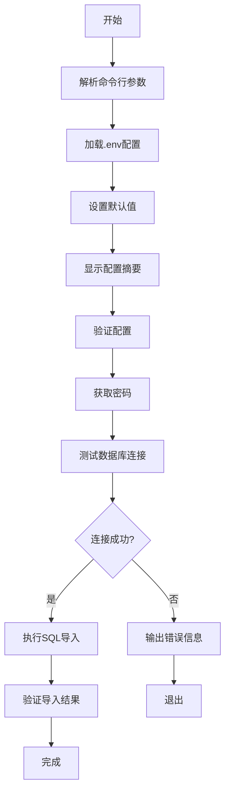

# init-db.sh 脚本解析文档

## 概述
`init-db.sh` 是独角数卡(dujiaoka)项目的数据库初始化脚本，用于快速导入 `install.sql` 到 MySQL 数据库。脚本设计考虑了多种使用场景，支持命令行参数、.env 配置文件、交互式密码输入和 Docker 容器执行。

## 基本信息
- **文件位置**: `/Users/zack/Desktop/dujiaoka/init-db.sh`
- **版本**: 1.0.0
- **脚本类型**: Bash Shell 脚本
- **依赖**: MySQL客户端 或 Docker（可选）

## 功能特性

### 1. 配置来源多样化
- ✅ **命令行参数**: 支持所有数据库连接参数的单独指定
- ✅ **.env文件**: 自动读取项目 `.env` 文件中的数据库配置
- ✅ **默认值**: 提供合理的默认配置
- ✅ **优先级**: 命令行参数 > .env配置 > 默认值

### 2. 执行模式灵活
- ✅ **本地执行**: 使用系统安装的 `mysql` 客户端
- ✅ **Docker执行**: 使用 `mysql:8.0` 容器，无需本地安装客户端
- ✅ **交互式密码输入**: 安全输入密码，避免密码泄露
- ✅ **静默模式**: 减少输出，适合自动化场景

### 3. 安全特性
- ✅ **密码隐藏**: 交互式输入使用 `read -rs` 隐藏输入
- ✅ **配置优先级**: 避免敏感配置被意外覆盖
- ✅ **错误隔离**: 详细的错误信息和验证步骤

### 4. 验证机制
- ✅ **连接测试**: 导入前测试数据库连接
- ✅ **文件验证**: 检查 SQL 文件是否存在
- ✅ **导入验证**: 导入后检查表数量和关键数据
- ✅ **参数验证**: 验证端口号等参数格式

## 使用方法

### 基本用法
```bash
# 给予执行权限
chmod +x init-db.sh

# 使用默认配置（从.env读取）
./init-db.sh

# 查看帮助
./init-db.sh --help

# 查看版本
./init-db.sh --version
```

### 常用命令示例
```bash
# 使用Docker容器执行（无需本地mysql客户端）
./init-db.sh --docker

# 交互式输入密码（更安全）
./init-db.sh --interactive

# 静默模式（仅输出错误信息）
./init-db.sh --quiet

# 跳过导入后的验证
./init-db.sh --skip-verify

# 自定义数据库连接
./init-db.sh -h 192.168.1.100 -P 3307 -u admin -d mydb -f /path/to/install.sql
```

### 参数详解
| 参数 | 简写 | 说明 | 默认值 |
|------|------|------|--------|
| `--host` | `-h` | 数据库主机地址 | `localhost` |
| `--port` | `-P` | 数据库端口 | `3306` |
| `--user` | `-u` | 数据库用户名 | `root` |
| `--password` | `-p` | 数据库密码 | 从.env读取或交互式输入 |
| `--database` | `-d` | 数据库名 | `dujiaoka` |
| `--file` | `-f` | SQL文件路径 | `database/sql/install.sql` |
| `--docker` | - | 使用Docker容器执行 | `false` |
| `--interactive` | - | 强制交互式密码输入 | `false` |
| `--quiet` | - | 静默模式（减少输出） | `false` |
| `--skip-verify` | - | 跳过导入后的验证 | `false` |
| `--help` | - | 显示帮助信息 | - |
| `--version` | - | 显示版本信息 | - |

## 代码结构分析

### 整体架构
脚本采用模块化设计，主要包含以下部分：

1. **配置管理** (`load_env_config`, `parse_args`, `set_defaults`)
2. **验证检查** (`validate_config`, `test_db_connection`)
3. **导入执行** (`import_via_docker`, `import_via_local`)
4. **结果验证** (`verify_import`)
5. **工具函数** (日志函数、帮助函数)

### 关键函数说明

#### `load_env_config()`
- **功能**: 从 `.env` 文件加载数据库配置
- **实现**: 使用 `grep` 提取配置，避免 `source` 的安全风险
- **特点**: 支持注释和空白字符处理
- **限制**: 不能处理行尾注释（如 `DB_PASSWORD=secret # 注释`）

#### `parse_args()`
- **功能**: 解析命令行参数
- **实现**: 简单的 `case` 语句解析
- **特点**: 支持长短参数格式
- **限制**: 缺少参数值验证（如 `-p` 后是否跟有效值）

#### `test_db_connection()`
- **功能**: 测试数据库连接
- **实现**: 执行 `SELECT 1;` 验证连接
- **Docker模式**: 使用 `eval` 执行，存在潜在安全风险
- **本地模式**: 直接调用 `mysql` 客户端

#### `import_via_docker()` 和 `import_via_local()`
- **功能**: 分别通过 Docker 容器和本地客户端导入 SQL
- **Docker模式**: 使用 `docker run` 挂载 SQL 文件
- **本地模式**: 使用输入重定向 `<`
- **密码处理**: Docker 使用环境变量，本地使用 `--password` 选项

## 安全问题分析

### 已实现的安全措施
1. ✅ **交互式密码输入**: 使用 `read -rs` 隐藏输入
2. ✅ **避免密码记录**: 不在命令行历史中记录密码
3. ✅ **配置优先级**: 防止敏感配置被意外覆盖
4. ✅ **文件权限检查**: 验证 SQL 文件存在性
5. ✅ **参数验证**: 验证端口号为数字

### 潜在安全风险
1. ⚠️ **eval 使用**: `test_db_connection()` 中使用 `eval`，如果密码包含特殊字符可能有问题
2. ⚠️ **密码命令行传递**: 本地模式下密码通过 `--password=$DB_PASS` 传递，可能被 `ps` 命令看到
3. ⚠️ **环境变量泄漏**: Docker 模式下使用 `MYSQL_PWD` 环境变量
4. ⚠️ **SQL 文件注入**: 如果 SQL 文件被篡改，可能执行恶意 SQL

### 建议改进
1. **替换 eval**: 重构 `test_db_connection()` 避免使用 `eval`
2. **配置文件支持**: 添加 `--config-file` 选项支持 MySQL 配置文件
3. **密码转义**: 对密码中的特殊字符进行转义处理
4. **连接超时**: 添加连接超时设置，避免长时间等待

## 技术细节

### 配置加载逻辑
```bash
# 配置优先级（从高到低）
1. 命令行参数 (如 -h 192.168.1.100)
2. .env 文件配置 (如 DB_HOST=localhost)
3. 脚本默认值 (如 DEFAULT_DB_HOST="localhost")
```

### 密码处理流程
```bash
# 密码来源（按优先级）
1. 命令行参数 (-p password)
2. .env 文件 (DB_PASSWORD=password)
3. 交互式输入 (--interactive)
4. 空密码（如果允许）
```

### 执行流程


## 边界情况和错误处理

### 处理的边界情况
1. **SQL 文件不存在**: 检查并报错退出
2. **数据库连接失败**: 提供详细的错误排查建议
3. **端口号无效**: 验证是否为数字
4. **密码为空**: 警告但继续执行
5. **.env 文件不存在**: 跳过配置加载

### 未处理的边界情况
1. **SQL 文件路径包含空格**: Docker 挂载可能失败
2. **密码包含特殊字符**: 可能引起命令行解析问题
3. **数据库已存在数据**: 可能覆盖现有数据
4. **网络超时**: 没有设置连接超时
5. **权限不足**: 用户缺乏必要的数据库权限

## 性能考虑

### 优点
1. **快速失败**: 使用 `set -e` 在错误时立即退出
2. **最小化依赖**: Docker 模式无需本地 MySQL 客户端
3. **并行性**: 顺序执行，避免复杂并发问题

### 潜在瓶颈
1. **大文件处理**: 对于超大 SQL 文件，可能需要调整 MySQL 参数
2. **网络延迟**: 远程数据库连接可能较慢
3. **容器启动**: Docker 模式需要拉取镜像（首次运行）

## 兼容性

### 支持的平台
- ✅ Linux (主要测试平台)
- ✅ macOS (理论上支持)
- ⚠️ Windows (需要 WSL 或 Git Bash)

### 依赖要求
- **Bash**: 版本 4.0+（使用数组等高级特性）
- **MySQL**: 5.7+ 或 8.0+
- **Docker**: 20.10+（如果使用 Docker 模式）
- **Coreutils**: 标准 Unix 工具集

## 改进建议

### 高优先级
1. **修复 eval 安全问题**: 重构 `test_db_connection()` 函数
2. **增强密码处理**: 支持密码中的特殊字符
3. **添加超时设置**: 防止长时间挂起

### 中优先级
1. **配置文件支持**: 支持 MySQL 配置文件（my.cnf）
2. **进度显示**: 显示 SQL 导入进度
3. **备份功能**: 导入前自动备份现有数据

### 低优先级
1. **颜色主题**: 允许自定义日志颜色
2. **多语言支持**: 支持英文/中文切换
3. **插件架构**: 支持扩展功能

## 使用建议

### 开发环境
```bash
# 使用 Docker 模式，避免安装 MySQL 客户端
./init-db.sh --docker --interactive
```

### 生产环境
```bash
# 使用配置文件，避免密码泄露
# 建议创建专门的 MySQL 用户和配置文件
./init-db.sh --quiet --skip-verify
```

### 自动化脚本
```bash
# 静默模式，适合 CI/CD 流水线
./init-db.sh --quiet --docker 2>/dev/null || exit 1
```

## 故障排查

### 常见问题

#### 1. 数据库连接失败
```bash
# 检查数据库服务
systemctl status mysql

# 验证网络连接
telnet <host> <port>

# 检查防火墙设置
sudo ufw status
```

#### 2. 权限不足
```sql
-- 授予必要权限
GRANT ALL PRIVILEGES ON dujiaoka.* TO 'user'@'%';
FLUSH PRIVILEGES;
```

#### 3. SQL 导入失败
```bash
# 检查 SQL 文件语法
head -n 50 database/sql/install.sql

# 手动测试导入
mysql -u root -p dujiaoka < database/sql/install.sql
```

#### 4. Docker 模式失败
```bash
# 检查 Docker 服务
docker --version
docker ps

# 检查镜像是否存在
docker images mysql:8.0
```

## 总结

`init-db.sh` 是一个功能完善、设计合理的数据库初始化脚本，具有以下特点：

### 优点
1. **功能全面**: 支持多种配置来源和执行模式
2. **使用灵活**: 丰富的命令行选项满足不同场景
3. **安全考虑**: 基本的密码保护和错误处理
4. **文档完整**: 详细的帮助信息和错误提示

### 注意事项
1. **安全风险**: 注意密码在命令行中的暴露风险
2. **特殊字符**: 密码中的特殊字符可能导致问题
3. **环境依赖**: 确保满足 Bash、MySQL 或 Docker 要求

### 推荐使用场景
1. **快速部署**: 一键初始化数据库
2. **开发测试**: 灵活的配置选项
3. **自动化流程**: 静默模式适合集成

通过合理使用和适当配置，该脚本可以显著简化独角数卡项目的数据库初始化工作。